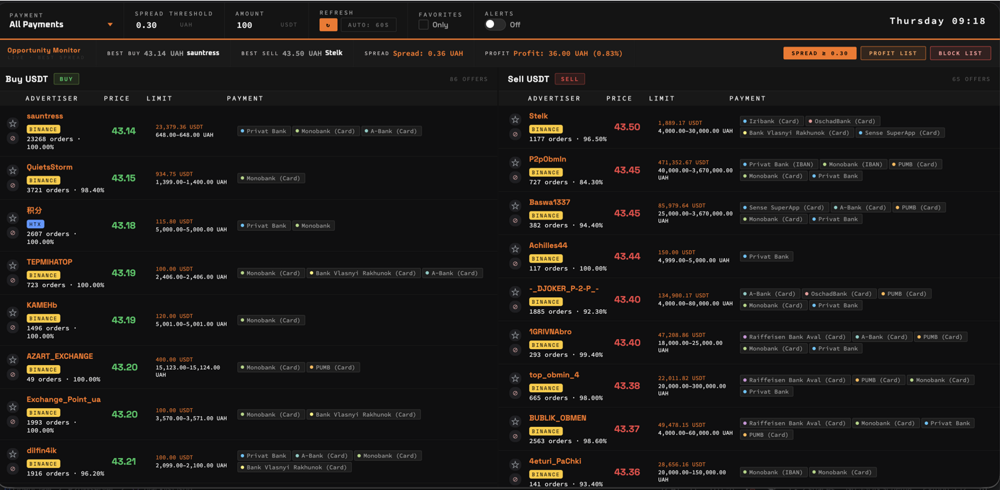
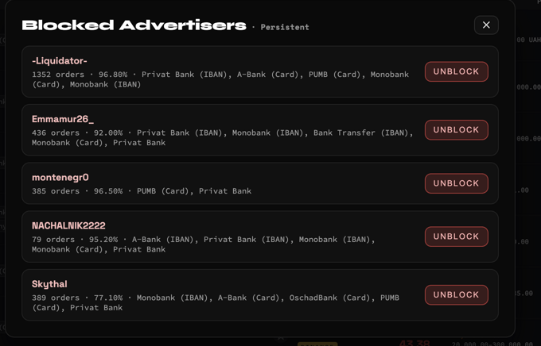

<p align="center">
  
</p>

<h1 align="center">P2P Opportunity Monitor</h1>

<p align="center">
  <strong>Real-time P2P arbitrage dashboard for USDT/UAH across Binance & HTX</strong>
</p>

<p align="center">
  
  
  
  
</p>

<p align="center">
  <a href="https://p2p.0-0.stream/"><strong>🚀 Live Demo →</strong></a>
</p>

---

## Overview

P2P Opportunity Monitor aggregates live P2P ads from Binance and HTX, identifies the best buy/sell spreads, and surfaces actionable arbitrage pairs in a clean real-time dashboard. Designed for speed: filter by payment method, track trusted advertisers, block noise, and act on signals instantly.

---

## Features

| Feature | Description |
|---|---|
| **Live Opportunity Monitor** | Best buy/sell spread, profit estimate (UAH & %), and alert state — updated every 60s |
| **Cross-Exchange Coverage** | Binance and HTX ads aggregated in a single unified view |
| **Favorites Workflow** | Star trusted advertisers to pin them to the top of the list |
| **Blacklist Controls** | Block/unblock advertisers with state persisted to JSON |
| **Payment Filter** | Filter by 20+ Ukrainian payment methods (Monobank, Privat Bank, A-Bank, PUMB, etc.) |
| **Spread Threshold** | Set a minimum spread threshold — only relevant opportunities surface |
| **Profit List** | Ranked view of the top profitable buy/sell pairs at a glance |
| **Alert System** | Toggle audio/visual alerts when a spread opportunity is detected |

---

## Screenshots

<table>
  <tr>
    <td align="center" width="33%">
      
      <br/><sub><b>Main Dashboard — Buy/Sell Board</b></sub>
    </td>
    <td align="center" width="33%">
      
      <br/><sub><b>Profit List — Top Opportunities</b></sub>
    </td>
    <td align="center" width="33%">
      
      <br/><sub><b>Blacklist — Blocked Advertisers</b></sub>
    </td>
  </tr>
</table>

---

## How It Works

```
1. Fetch     →  Pull live P2P ads from Binance & HTX APIs
2. Compute   →  Calculate best spreads and profit estimates per pair
3. Render    →  Display a filterable, real-time dashboard in the browser
4. Persist   →  Save favorites and blacklist to local JSON on every change
```

---

## Quick Start

**Run once** (single fetch, then exit):
```bash
python fetch_binance_p2p_uah_usdt.py --once
```

**Run with auto-refresh** (polls every 60s by default):
```bash
python fetch_binance_p2p_uah_usdt.py
```

Then open `binance_p2p_uah_usdt.html` in your browser, or use the local server URL printed in the terminal.

---

## Dashboard Controls

| Control | Description |
|---|---|
| **Payment** | Filter ads by accepted payment method |
| **Spread Threshold** | Hide pairs below this UAH spread |
| **Amount** | Set your USDT trade size for profit calculations |
| **Refresh** | Manual refresh or auto every 60s |
| **Favorites Only** | Toggle to show only starred advertisers |
| **Alerts** | Enable sound/visual alert on new opportunities |
| **Spread ≥ X** | Quick-filter to highlight high-spread rows |
| **Profit List** | Open ranked top-opportunity panel |
| **Block List** | Manage blocked advertisers |

---

## Tech Stack

<p>
  
  
  
  
</p>

- **Python** — data fetching and local server
- **HTML / CSS / JS** — single-file frontend dashboard
- **JSON** — persistent local storage for favorites and blacklist

---

<p align="center">
  <sub>Built for high-signal monitoring · Fast filtering · Persistent preferences</sub>
</p>
